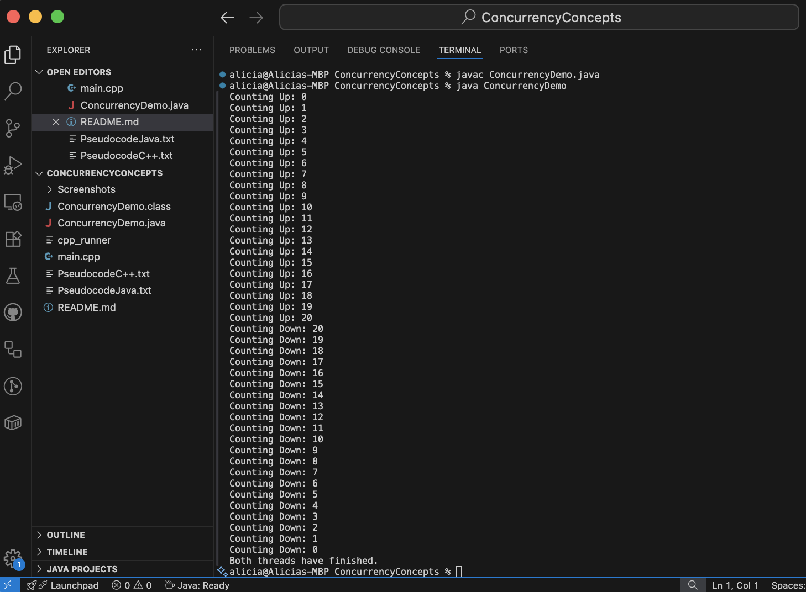
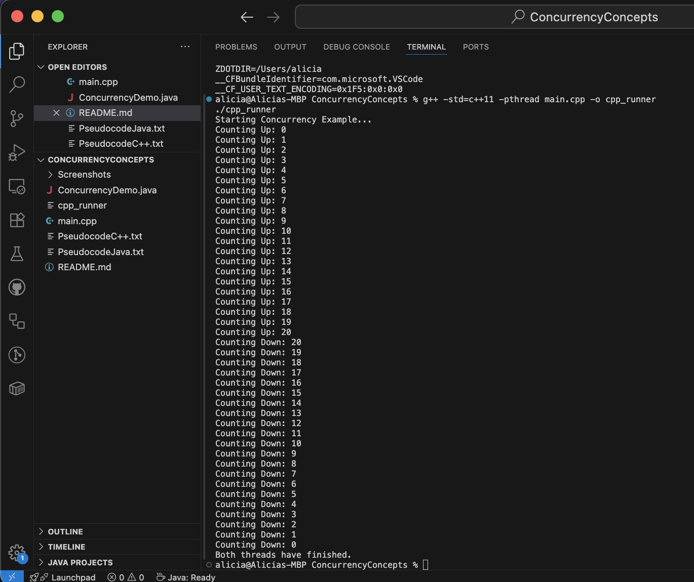
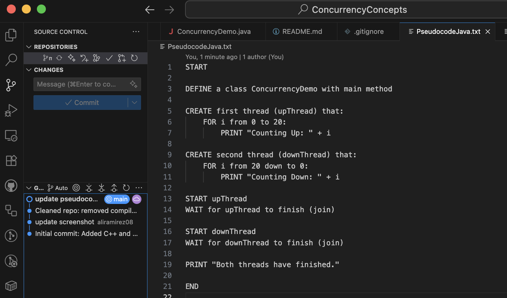
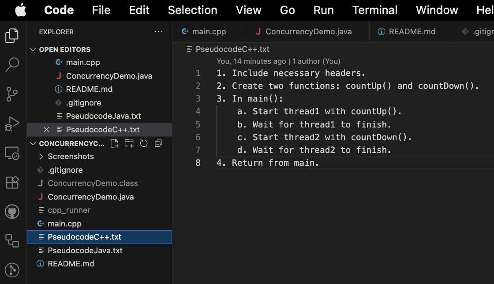
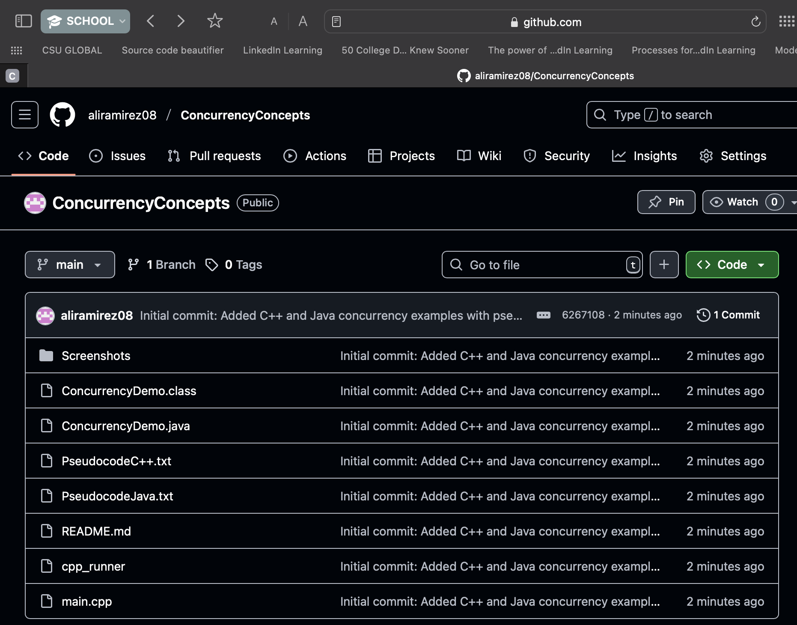

# Concurrency Concepts

This project demonstrates fundamental concurrency concepts using both **C++** and **Java**. The programs create and manage multiple threads that count upward and downward while coordinating execution using thread synchronization techniques such as `join()`. The project highlights how concurrency is implemented differently in each language while achieving the same behavior.

---

## Features

- Multithreading examples in both Java and C++
- Demonstrates thread creation and execution
- Sequential thread coordination using `join()`
- Console-based output for easy visualization
- Includes pseudocode for both implementations
- Shows safe thread synchronization behavior

---

## Concepts Demonstrated

- Concurrency
- Parallel execution
- Thread lifecycle
- Thread synchronization
- Thread coordination
- Sequential execution using `join()`
- Mutex usage in C++
- JVM thread handling in Java

---

## Technologies used

- Java
- C++
- VS Code
- Git
- GitHub
- Terminal / Command Line

---

## Project Structure

```text
ConcurrencyConcepts/
├── Screenshots/
├── ConcurrencyDemo.java
├── main.cpp
├── PseudocodeJava.txt
├── PseudocodeC++.txt
├── README.md
└── .gitignore
```

---

# Prerequisites

- Java JDK installed
- javac and java configured in terminal
- C++

# Steps

## How to Run Java App

1. Clone the Repository
   
``` git clone https://github.com/aliramirez08/ConcurrencyConcepts.git
cd ConcurrencyConcepts
```

2. Compile

```
javac ConcurrencyDemo.java
```

3. Run

```
java ConcurrencyDemo
```

## How to Run C+++ App

1. Compile

```
g++ -std=c++11 -pthread main.cpp -o cpp_runner
```

2. Run

```
./cpp_runner
```

---

## Example Output

# Java Thread Example

```
Thread upThread = new Thread(() -> {
    for (int i = 0; i <= 20; i++) {
        System.out.println("Counting Up: " + i);
    }
});
```

# C+++ Thread Example
```
thread thread1(countUp);
thread1.join();
```

## What I Learned
- How threads operate in both Java and C++
- The importance of synchronization in concurrent programs
- How join() controls execution order
- The differences between Java’s managed concurrency model and C++’s lower-level thread management
- How mutexes help prevent unsafe shared access in C++
- How concurrency concepts apply across multiple programming languages

Future Improvements

- Add parallel thread execution examples
- Demonstrate race conditions and deadlocks
- Add semaphore and condition variable examples
- Include performance benchmarking
- Build a GUI visualization of thread execution
- Add unit tests
- Expand into producer-consumer examples

## Screenshots

### Java Program Output



---

### C++ Program Output



---

### Java Pseudocode



---

### C++ Pseudocode



---

### GitHub Repository


